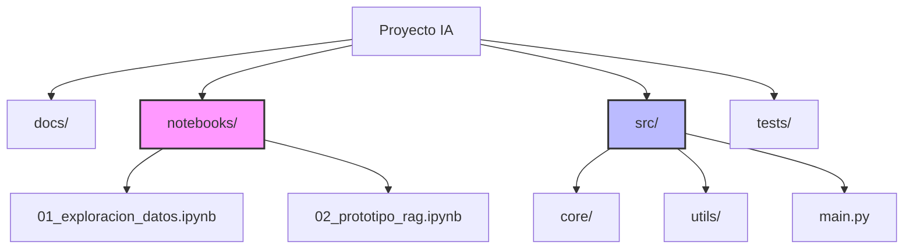

# Módulo 1.1: El Entorno de Python Moderno y Configuración Profesional

Este módulo establece las bases para un desarrollo profesional en IA Generativa. Aprenderemos a gestionar entornos virtuales modernos y a estructurar nuestros proyectos para escalar desde la experimentación hasta la producción.

## 1. Gestión de Entornos

El ecosistema de IA (LangChain, Google ADK, PyTorch) es complejo y propenso a conflictos de dependencias. Aislar nuestros proyectos es obligatorio.

### Herramientas Modernas

#### `uv` (de Astral)
Una herramienta extremadamente rápida escrita en Rust para gestionar paquetes y entornos Python. Es el reemplazo moderno recomendado para `pip` y `venv` en muchos casos.

```bash
# Instalación de uv
pip install uv

# Crear un entorno virtual
uv venv

# Activar el entorno (Windows)
.venv\Scripts\activate

# Instalar dependencias rápidamente
uv pip install openai langchain google-genai
```

#### `venv` (Estándar)
La herramienta integrada en Python. Sólida y disponible en todas partes.

```bash
# Crear entorno
python -m venv .venv

# Activar
.venv\Scripts\activate
```

## 2. Estructura del Proyecto

Es crucial diferenciar entre el código de "Laboratorio" (Notebooks) y el código de "Fábrica" (Scripts de Producción).

### Estructura Recomendada



### Notebooks vs Scripts

| Característica | Notebooks (.ipynb) | Scripts (.py) |
| :--- | :--- | :--- |
| **Uso Principal** | Exploración, Visualización, Prototipado Rápido | Producción, Automatización, Despliegue |
| **Estado** | Persistente en memoria (puede ser confuso) | Lineal y limpio en cada ejecución |
| **Control de Versiones** | Difícil (JSON grande) | Excelente (Texto plano) |
| **Modularidad** | Baja | Alta (Importaciones limpias) |

## Ejercicio Práctico

Revisa los scripts en la carpeta `code/` para ver:
1.  `check_env.py`: Un script para validar que tu entorno está correctamente configurado y detectar si estás en un entorno virtual.
2.  `structure_demo.py`: Un ejemplo de cómo organizar importaciones en una estructura modular.
