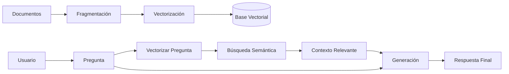

# Módulo 3.1: Arquitectura RAG Fundamental

Retrieval Augmented Generation (RAG) es la técnica estándar para mitigar alucinaciones y dar acceso a datos privados al LLM.

## 1. El Pipeline de Datos

El flujo de datos en RAG es lineal pero crítico en cada paso.

## 2. Estrategias de Chunking

Cortar el texto es un arte.
*   **Fixed Size:** Cortar cada 500 caracteres. Rápido pero rompe frases.
*   **Recursive Character:** Cortar por párrafos, luego frases, luego palabras. El estándar de LangChain.
*   **Semantic Chunking:** Cortar cuando cambia el tema (usando embeddings).

### Overlap (Solapamiento)
Es crucial dejar un margen (ej. 50 caracteres) entre chunks para no perder contexto en los bordes de corte.

## Ejercicio Práctico

Revisa `code/simple_rag_pipeline.py` para ver una implementación "desde cero" de este pipeline usando listas de Python (sin Vector DB compleja) para entender la lógica.
